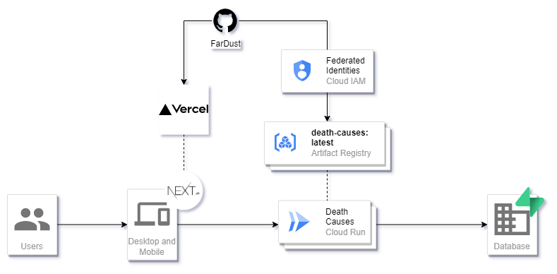

# Death Causes on US 

This project its a web viewer of the data of the death causes in the US from 2014 to 2019.
The source data can be found in the [CDC](https://catalog.data.gov/dataset/monthly-counts-of-deaths-by-select-causes-2014-2019-da9df).

## Project Structure

The project is divided in three parts, the infrastructure, the backend and the frontend. The cloud providers were selected due to the free tier and the simplicity of the services.

### Infrastructure

The infrastructure is contained under the root folder.
The infrastructure is a terraform project that creates the resources in GCP.

The database is hosted by Supabase, a Postgres database with a lot of features.

### Backend

The backend is contained under the `death-causes-backend` folder as submodule.
The backend is a NestJS project that connects to the database and exposes the data to the frontend. The backend is a wrapper of the Supabase SDK.

### Frontend

The frontend is contained under the `death-causes-frontend` folder as submodule.
The frontend is a React project that consumes the data from the backend.

### Data Processing

The data processing is contained under the `data_processing` folder. The data processing is a jupyter notebook that processes the data from the CDC and downloads relationized data.
